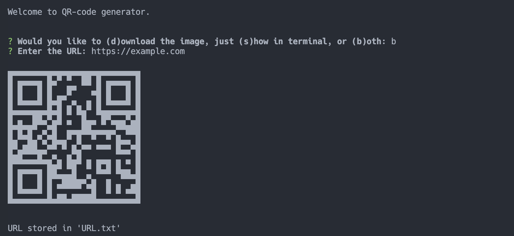

# QR Code Generator

This is a simple command-line tool built with Node.js that allows you to generate QR codes from URLs. It utilizes the `inquirer`, `qr-image`, and `qrcode-terminal` npm packages.

## Installation

Before running the generator, make sure you have Node.js installed on your system. Then, follow these steps:

1. Clone this repository to your local machine.
2. Navigate to the project directory in your terminal.
3. Install dependencies by running:
    ```bash
    npm install
    ```

## Usage

To use the QR Code Generator, follow these steps:

1. Open your terminal and navigate to the project directory.
2. Run the generator by executing the following command:
    ```bash
    node index.js
    ```
3. Follow the prompts:
    - Choose whether you want to download the QR code image, show it in the terminal, or both.
    - Enter the URL you want to generate a QR code for.

## Options

- **Download (d)**: Downloads the generated QR code image as `qr-image.png`.
- **Show (s)**: Displays the generated QR code in the terminal.
- **Both (b)**: Downloads the QR code image and displays it in the terminal.

## Example

Here's an example of how the generator works:

